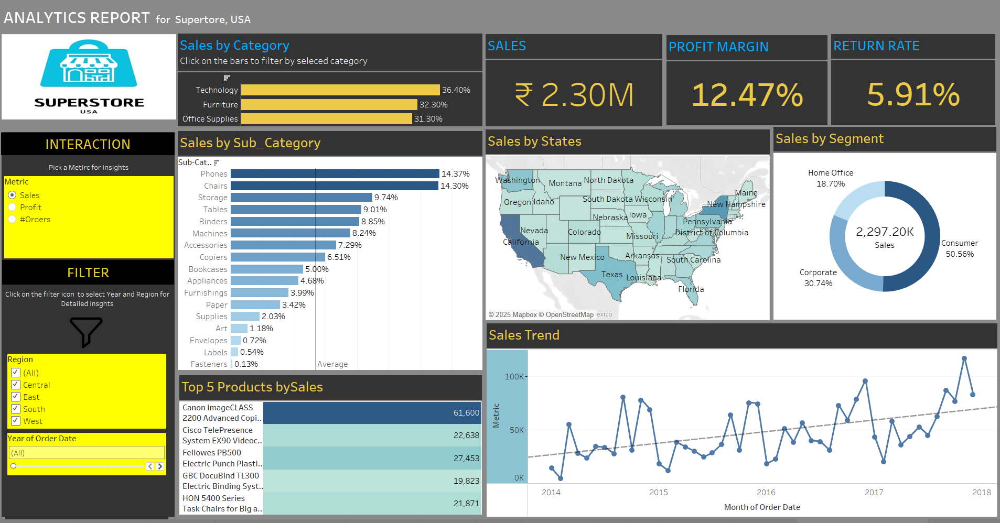

# Super Store Analysis

## Project Objective
The goal of this project is to analyze Super Store’s sales data and generate actionable, data-driven insights to support strategic decision-making.

---

## Dashboard Overview

---

## Key Insights

### 1. Overall Performance
- **Total Sales:** ₹2.30 million  
- **Profit Margin:** 12.47%  
- **Return Rate:** 5.91%  

### 2. Category Performance
- **Highest Profit Margin:** Data Analytics (50.79%)  
- **Highest Sales Volume:** Office Supplies  
- **Lowest Profit Margin:** Furniture  

### 3. Sub-Category Performance
- **Strongest Performers:** Copiers and Accessories (highest margins)  
- **Weakest Performers:** Paper and Binders (lowest margins)  

### 4. Segment Performance
- **Best Segment:** Home Office  
- **Lowest Segment:** Corporate  

### 5. Profit Trend (2014–2018)
- Profits generally increased year-over-year.  
- A slight dip was observed in 2015.  

### 6. Top Products by Profit
- **Most Profitable Product:** Canon imageCLASS 2200 Advanced Copier  

### 7. Additional Observations
- **Regional Performance:** The **West** region leads, as indicated by the color-coded map.  
- **Time-Based Analysis:** The dashboard provides filters by year, enabling detailed performance tracking over time.  

---
